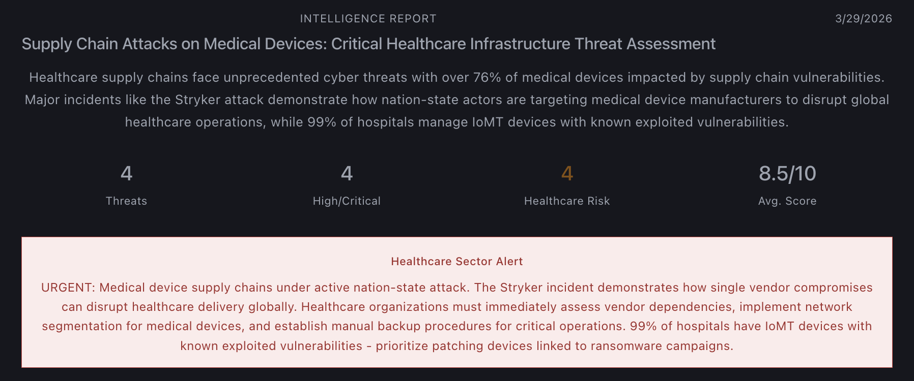
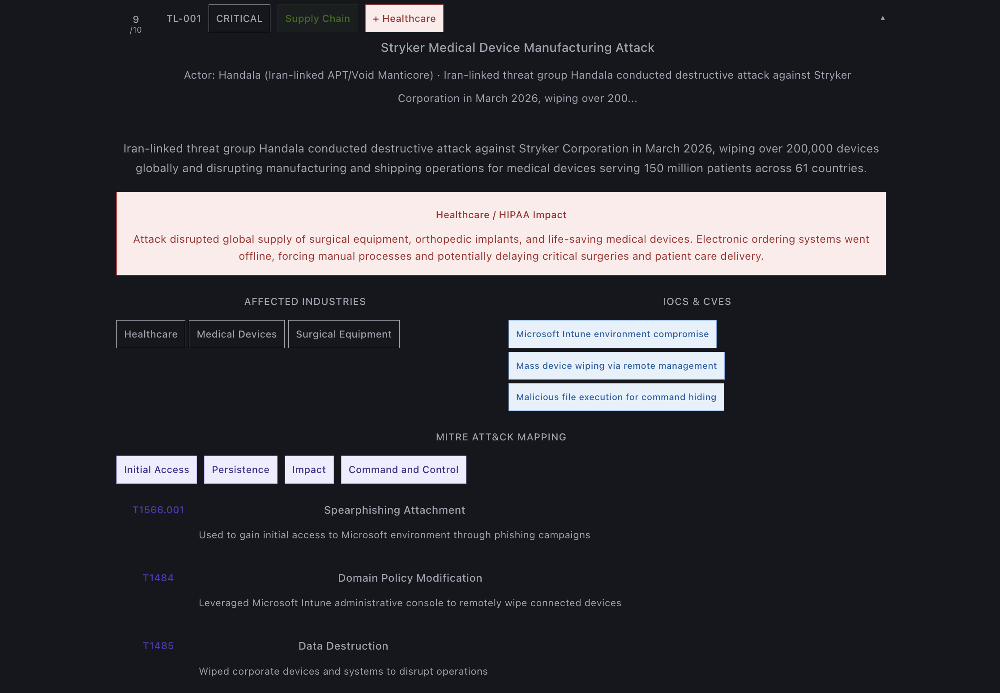
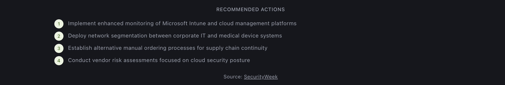

# ThreatLens — AI-Powered Threat Intelligence Summarizer

> Real-time threat intelligence, MITRE ATT&CK mapping, and healthcare sector analysis — powered by Claude AI and live web search.

## Screenshots

### Threat Intelligence Dashboard

### Expanded Threat Card — MITRE ATT&CK Mapping

### Recommended Actions

## Overview

## Screenshots

### Threat Intelligence Dashboard

### Expanded Threat Card — MITRE ATT&CK Mapping

### Recommended Actions

ThreatLens is a production-grade threat intelligence platform that uses the Anthropic Claude API with live web search to automatically:

- Pull real-time cybersecurity threat data from across the internet
- Summarize threats with structured severity scoring (1–10 scale)
- Identify affected industries including healthcare, finance, energy, and government
- Map threats to MITRE ATT&CK techniques and tactics (Enterprise v15)
- Extract IOCs — CVEs, behavioral indicators, malicious domains
- Generate healthcare-specific alerts with HIPAA implications
- Provide analyst notes with operational recommendations

## Stack

React · Anthropic Claude API · web_search tool · MITRE ATT&CK v15 · NIST SP 800-61

## About

Built by **D'Anthony Carter-Marshall** | CompTIA Security+ (SY0-701) | University of Kansas Health System | Secret clearance eligible

github.com/dcartermarshall